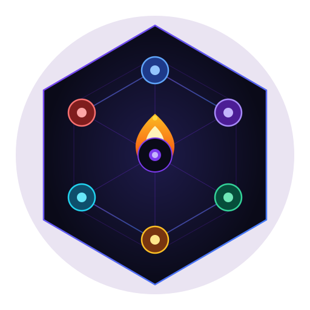

<div align="center">
  
  <h1>AgentForge</h1>
  <p><strong>Open-source, self-hosted AI software team platform.</strong></p>
  <p>Route each agent role to the cheapest capable model across all your AI subscriptions.<br/>Structured artifact handoffs. No free-form agent chat. Token-optimized.</p>

  <p>
    
    
    
    
    
  </p>

  <p>
    <a href="https://saiz123.github.io/AgentForge">🌐 Website</a> &nbsp;·&nbsp;
    <a href="https://github.com/saiz123/AgentForge/issues">🐛 Issues</a> &nbsp;·&nbsp;
    <a href="docs/development.md">📖 Docs</a> &nbsp;·&nbsp;
    <a href="docs/self-hosting.md">🐳 Self-hosting</a>
  </p>

  <br/>
  <blockquote>
    🔨 <strong>Work in Progress</strong> — v0.1 alpha. Core pipeline works end-to-end. Not production-ready yet.
  </blockquote>
</div>

---

## What is AgentForge?

You already pay for Anthropic, OpenAI, Gemini, and Ollama subscriptions. AgentForge puts them all to work together — routing each task in the pipeline to the **cheapest capable model** across all your providers:

| Stage | Default routing | Why |
|---|---|---|
| Intake | Gemini Flash / GPT-4o-mini | Cheap extraction, structured JSON output |
| Architecture | Claude Sonnet / o4-mini | Strong reasoning, no code context needed |
| Build | Claude Sonnet / GPT-4o | Code quality is highest priority |
| Review | **Different provider** from Builder | Genuine second opinion |
| Documentation | Gemini Flash / GPT-4o-mini | Template-like output, cheap |

Agents communicate through **structured JSON artifacts only** — no free-form chat. An orchestrator controls every handoff.

---

## Pipeline

```
User prompt
    ↓
Intake ──→ requirements.json
    ↓
Architect ──→ architecture.json
    ↓
Task Breakdown ──→ task-list.json
    ↓
Build (per task) ──→ code-diff  ←── context-pack (relevant files only)
    ↓
Test ──→ test-result.json
    ↓
Review ──→ review.json          ←── diff only (not full repo)
    ↓
Repair loop (max 3×) ──→ patch  ←── compressed error log + diff
    ↓
Documentation ──→ final-report.md
    ↓
Report (SQLite + CLI table)
```

---

## Status

**v0.1 alpha — all 10 build phases complete. Security audit reviewed and fixed.**

| Phase | Status | Description |
|---|---|---|
| 0 — Scaffold | ✅ Done | pnpm monorepo, 13 packages, tooling |
| 1 — CLI | ✅ Done | `agentforge init/build/plan/doctor/providers/report/serve` |
| 2 — Providers | ✅ Done | Anthropic, OpenAI, Gemini, Ollama, OpenRouter, Mock |
| 3 — Model Router | ✅ Done | Cross-provider cheapest-model selection |
| 4 — Token/Cost Engine | ✅ Done | 3-layer budget enforcement, cost tracking |
| 5 — Orchestrator | ✅ Done | 9-stage pipeline, repair loop, budget abort |
| 6 — Context Engine | ✅ Done | File relevance scoring, chunking, diff extraction |
| 7 — Workspace Engine | ✅ Done | File I/O, Git, sandboxed command runner |
| 8 — Real Build | ✅ Done | End-to-end `agentforge build`, SQLite persistence |
| 9 — Web Dashboard | ✅ Done | Next.js 16 + Hono API, run history, cost charts |
| 10 — Docker | ✅ Done | Full Docker Compose self-hosting |

**230 tests passing** across 28 test files. Security audit (June 2026) resolved: 15 of 18 findings fixed including all 6 critical issues.

---

## Requirements

- Node.js 20+
- pnpm 9+
- At least one AI provider API key

## Quick start

```bash
git clone https://github.com/saiz123/AgentForge.git
cd AgentForge
pnpm install && pnpm build

cp .env.example .env
# Add your API keys to .env

node apps/cli/dist/bin/cli.js init
node apps/cli/dist/bin/cli.js providers add
node apps/cli/dist/bin/cli.js doctor
node apps/cli/dist/bin/cli.js build "a CLI that reverses a string"
node apps/cli/dist/bin/cli.js report
```

### Web dashboard

```bash
node apps/cli/dist/bin/cli.js serve   # API on http://localhost:3001
pnpm --filter @agentforge/web dev     # UI on http://localhost:3000
```

### Docker

```bash
cp .env.example .env  # add your API keys
docker compose run --rm cli init
docker compose run --rm cli providers add
docker compose up -d
# Dashboard at http://localhost:3000
docker compose run --rm cli build "your project idea"
```

---

## Supported providers

| Provider | Key env var | Notes |
|---|---|---|
| Anthropic (Claude) | `ANTHROPIC_API_KEY` | Sonnet, Haiku — prompt caching supported |
| OpenAI | `OPENAI_API_KEY` | GPT-4o, GPT-4o-mini, o4-mini |
| Google Gemini | `GEMINI_API_KEY` | Gemini 1.5 Flash (very cheap), Pro |
| OpenRouter | `OPENROUTER_API_KEY` | Routes to 100+ models via one key |
| Ollama | none | Local models, zero cost |
| Custom OpenAI-compatible | `OPENAI_COMPATIBLE_ENDPOINT` | Azure, vLLM, LM Studio |

---

## Token optimization

- **Context engine** — scores file relevance, sends only the top-K chunks per task (never the full repo)
- **Diff-only review** — Reviewer sees `git diff`, not full files (60–90% token reduction)
- **Cheap-model routing** — intake/doc/summarize automatically go to cheapest capable model
- **Prompt cache layout** — stable system prompts in cacheable prefix (Anthropic + OpenAI)
- **Log compression** — stack traces truncated to 5 frames, errors deduplicated before repair loop
- **3-layer budget** — per-call token cap → per-stage USD limit → per-run hard abort
- **Repair loop cap** — 3 iterations max; exits cleanly on failure

---

## Security

- API keys read from env vars only — never stored in config files or SQLite
- Secret redaction on all log output (message + structured data)
- Sandboxed command runner — allowlist enforced, shell metacharacters blocked
- Sanitized child process environment — API keys stripped before test/build commands run
- Path traversal prevention on all file operations

---

## Known Limitations

- **Command execution is allowlisted, not sandboxed** — generated project commands run locally with an allowlist. Docker process isolation is a planned future hardening milestone.
- **Dry-run calls intake + architect** — planning stages make real model calls even in dry-run. File writes, git commits, and test/build commands are skipped.
- **API has no auth by default** — set `AGENTFORGE_API_TOKEN` in `.env` before exposing the API beyond localhost.
- **Cloud provider E2E requires real keys** — may incur costs. Not run in CI.
- **Provider model pricing is static** — update `packages/providers/src/models/*.json` when provider prices change.
- **Web Dockerfile uses npm** — standalone build context, does not use the root pnpm workspace.

---

## Documentation

- [Architecture](docs/architecture.md) — system design and data flow
- [Provider Design](docs/provider-design.md) — adapter interface and model metadata
- [Token Optimization](docs/token-optimization.md) — how cost is minimized
- [Security](docs/security.md) — key handling, sandboxing, secret redaction
- [Self-Hosting](docs/self-hosting.md) — Docker Compose setup
- [Development](docs/development.md) — how to contribute and extend AgentForge

---

## License

MIT — see [LICENSE](LICENSE).
